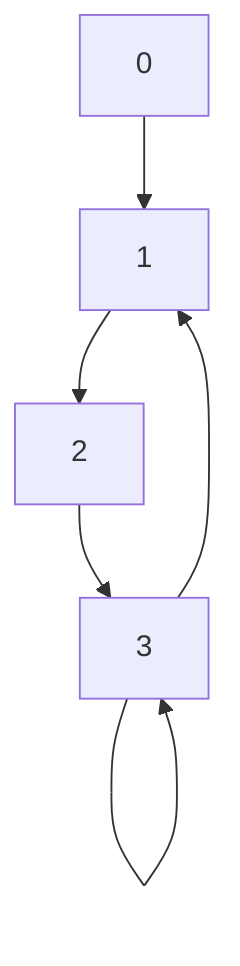

# litegraph
A lightweight header only C++ library for graph abstraction and implementation

### Install

Copy paste `inc/litegraph.cpp` to custom project or install to system with `sudo make install`

### Test

Compile the `example_test` with `make` and run with `make run`. The example test instantiates and runs routines on the following example graph:

### API

API and documentation in [API-docs](./docs/api.md)